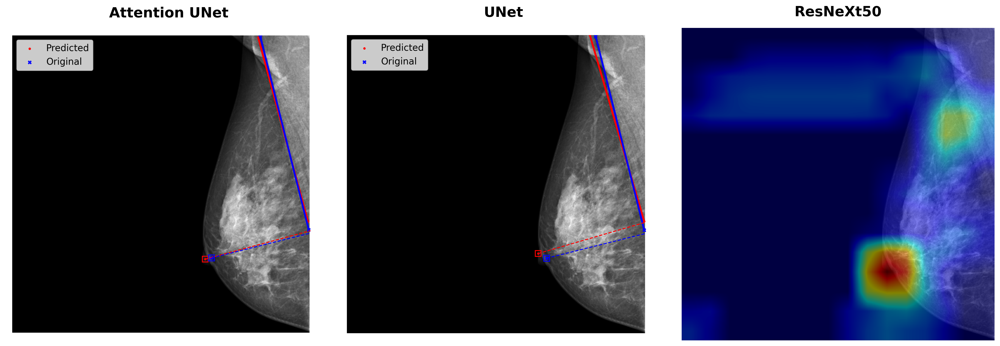

# MLO Breast Positioning Assessment via Deep Learning

Breast cancer is a leading cause of cancer-related mortality in women worldwide, making early detection through mammography screening critically important. The effectiveness of mammography, however, depends heavily on accurate breast positioning. Suboptimal positioning can result in missed findings, increased patient discomfort, and unnecessary repeat imaging.

This repository implements a deep learning pipeline for quantitative assessment of mediolateral oblique (MLO) mammogram positioning quality. The pipeline detects anatomical landmarks — the nipple and pectoralis muscle — and automatically delineates the Posterior Nipple Line (PNL) to evaluate positioning quality. Two segmentation-based regression models (UNet and Attention UNet) and one classification model (ResNeXt50) are included. All three models are evaluated under a **10-fold stratified cross-validation** protocol, with paired statistical tests reported.

## Repository Structure

```
├── code/
│   ├── classification/          # ResNeXt50 binary quality classifier
│   │   ├── main.py              # Training entry point
│   │   ├── test.py              # Inference + GradCAM visualization
│   │   └── utils/               # Dataloader, model, loss, metrics
│   └── regression/              # Landmark regression models (UNet / Attention UNet)
│       ├── main/
│       │   ├── main.py          # Training entry point
│       │   ├── evaluation.py    # Per-fold evaluation with distance metrics
│       │   ├── visualize_test_predictions.py
│       │   ├── configs/         # example_config.json, example_eval_config.json
│       │   └── utils/           # Dataloader, models, loss, train, validate
│       └── preprocessing/       # DICOM preprocessing pipeline
├── scripts/                     # 10-fold CV pipeline (Python)
│   ├── cv_splits.py             # Generate positioning_labels_fold_{2..10}.csv
│   ├── cv_generate_configs.py   # Generate per-fold training & eval configs
│   └── verify_folds.py          # Sanity-check fold disjointness and coverage
├── statistical_test/            # Paired statistics on 10-fold results
│   ├── run_cv_statistics.py     # Wilson CI, McNemar, Cochran's Q, Wilcoxon, Cohen's d, bootstrap
│   ├── requirements.txt
│   └── README.md
├── configs/                     # Per-fold training/eval configs (generated)
├── labels/                      # Dataset annotation details + fold split CSVs
└── results/                     # Per-fold evaluation exports (generated, not committed)
```

## Dataset

The cross-validation pool comprises **1,000 mammography exams (2,000 MLO images: L-MLO + R-MLO per exam)** randomly drawn from the public [VinDr-Mammo](https://vindr.ai/datasets/mammo) dataset. Annotator details (landmark vs qualitative labels, reader experience) are documented in [`labels/README.md`](labels/README.md).

**Reference label distribution over the 2,000-image pool:**

| Reference                          | Good  | Poor |
|------------------------------------|------:|-----:|
| Automated PNL-derived              | 1,253 |  747 |
| Expert qualitative (holistic ACR)  | 1,463 |  537 |

See [`labels/README.md`](labels/README.md) for full annotation details.

## Methodology — 10-fold Stratified Cross-Validation

- Folds are stratified by the qualitative label distribution to keep balanced Good / Poor class representation in each test partition. (The underlying `qualitativeLabel` CSV column stores these as `Good` / `Bad`.)
- Fold 1 uses the original split CSV (`labels/positioning_labels.csv`). Folds 2–10 use nine disjoint 200-image test blocks drawn from the remaining 1,800 SOPs (`rotating_9` mode of [`scripts/cv_splits.py`](scripts/cv_splits.py)); validation is resampled per fold with the same stratified Good / Poor counts.
- Per-fold training/eval configs are generated by [`scripts/cv_generate_configs.py`](scripts/cv_generate_configs.py); fold integrity is verified by [`scripts/verify_folds.py`](scripts/verify_folds.py).
- Statistics are computed by [`statistical_test/run_cv_statistics.py`](statistical_test/run_cv_statistics.py) on the per-fold eval exports under `results/`.

## Models

### Regression Models (Landmark Detection → Quality Assessment)

Both models take grayscale mammographic images as input and predict the coordinates of the nipple and pectoralis muscle landmarks. Positioning quality (good/poor) is then derived automatically from the resulting PNL geometry.

- **UNet** — Encoder–decoder architecture with skip connections, adapted for landmark coordinate regression.
- **Attention UNet (RAUNet)** — Extends UNet with attention gates at each decoder level to focus on anatomically relevant spatial regions.

### Classification Model

- **ResNeXt50** — ResNeXt-50 (32×4d) fine-tuned for direct binary positioning quality classification (good / poor), adapted to accept single-channel (grayscale) input.

## Installation

```bash
git clone https://github.com/enescanerkan/deep-breast-positioning.git
cd deep-breast-positioning
pip install torch torchvision pandas numpy scikit-learn matplotlib Pillow pydicom
pip install -r statistical_test/requirements.txt   # scipy, statsmodels for statistical analysis
```

## Usage

### Full 10-fold cross-validation workflow

```bash
# 1. Generate fold CSVs (fold 1 = original; folds 2–10 = rotating disjoint test blocks)
python scripts/cv_splits.py --mode rotating_9 --write --folds 2-10

# 2. Verify fold disjointness and coverage
python scripts/verify_folds.py

# 3. Generate per-fold training/eval configs under configs/
python scripts/cv_generate_configs.py --folds 2-10

# 4. Train + evaluate each model on each fold (see per-model sections below)
#    Per-fold eval exports are written to results/

# 5. Compute paired statistics on the pooled per-image and fold-level results
python statistical_test/run_cv_statistics.py
```

### Training — Regression Models

```bash
cd code/regression/main
python main.py --config configs/example_config.json              # baseline (config bundled under code/regression/main/configs/)
# or for a CV fold (configs generated by cv_generate_configs.py live at the repo-root configs/):
python main.py --config ../../../configs/RAUNet_fold_{k}.json
```

Set `model_type` to `"UNet"` or `"RAUNet"` in the config file.

### Training — Classification Model

```bash
cd code/classification
python main.py                                                    # baseline (uses the hardcoded DEFAULT_CONFIG in main.py)
# or for a CV fold (configs generated by cv_generate_configs.py live at the repo-root configs/):
python main.py --config ../../configs/ResNeXt50_fold_{k}.json
```

The baseline reads paths/hyperparameters from `DEFAULT_CONFIG` at the bottom of `main.py`; per-fold runs read the same fields from the JSON config.

### Evaluation — Regression

```bash
cd code/regression/main
python evaluation.py --config configs/example_eval_config.json   # baseline (writes evaluation_*.csv in the cwd)
# or for a CV fold (writes <results/>/RAUNet_fold_{k}_eval_per_image.csv via eval_artifact_stem):
python evaluation.py --config ../../../configs/RAUNet_fold_{k}_eval.json
```

### Inference + GradCAM — Classification

```bash
cd code/classification
python test.py                                                    # baseline: GradCAM saved to gradcam_outs/, predictions.csv in cwd
# or for a CV fold (writes <results/>/ResNeXt50_fold_{k}_eval.json consumed by run_cv_statistics.py):
python test.py --config ../../configs/ResNeXt50_fold_{k}_eval.json
```

Per-fold runs skip GradCAM by default and emit the per-image JSON next to the other fold outputs under `results/`.

## Hyperparameters

| Hyperparameter | Regression Models (UNet / Attention UNet)        | Classification Model (ResNeXt50) |
|----------------|--------------------------------------------------|----------------------------------|
| Task           | Landmark coordinate regression (Pec1, Pec2, Nipple) | Binary quality classification (Good / Poor) |
| Optimizer      | Adam                                             | Adam                             |
| Batch Size     | 8                                                | 8                                |
| Epochs         | 300                                              | 30                               |
| Learning Rate  | CyclicLR (base: 1e-5, max: 5e-4)                | CyclicLR (base: 1e-5, max: 5e-4) |
| Loss Function  | Wing Loss (per-landmark weighted)                | Cross-Entropy Loss             |
| Pretraining    | None (from scratch)                              | ImageNet                         |

## Performance — 10-fold Cross-Validation

All results below are pooled across the ten cross-validation folds (n = 2,000 MLO-view images total).

### Landmark Localization (Attention U-Net vs U-Net, mm)

Paired comparison on the 2,000 pooled test images.

| Landmark                  | U-Net Mean (Std) | Attention U-Net Mean (Std) | Mean Diff. [95% CI]     | Wilcoxon p | Cohen's d |
|---------------------------|-----------------:|---------------------------:|------------------------:|-----------:|----------:|
| Perpendicular intersection| 9.73 (7.26)      | **6.05 (5.69)**            | 3.68 [3.42, 3.94]       | < 0.001    | 0.62      |
| Pectoral muscle endpoint 1| 8.85 (8.86)      | **7.23 (7.35)**            | 1.62 [1.35, 1.90]       | < 0.001    | 0.26      |
| Pectoral muscle endpoint 2| 12.99 (12.35)    | **8.22 (9.84)**            | 4.76 [4.35, 5.16]       | < 0.001    | 0.52      |
| Nipple                    | 6.86 (5.67)      | **3.57 (3.98)**            | 3.30 [3.09, 3.49]       | < 0.001    | 0.70      |
| Angular agreement (°)     | 3.54 (3.10)      | **2.92 (2.78)**            | 0.63 [0.52, 0.74]       | < 0.001    | 0.25      |

*Mean Difference = U-Net error − Attention U-Net error (positive ⇒ U-Net worse). 95% CI from 10,000-resample bootstrap of paired differences. Paired Wilcoxon signed-rank test (two-sided).*

### Classification vs Automated PNL Reference

| Model           | Accuracy (%) [95% CI]       | Sensitivity (%) [95% CI]    | Specificity (%) [95% CI]    |
|-----------------|----------------------------:|----------------------------:|----------------------------:|
| Attention U-Net | **86.1 [84.5, 87.5]**       | **81.8 [78.9, 84.4]**       | 88.7 [86.8, 90.3]           |
| U-Net           | 73.9 [71.9, 75.7]           | 60.2 [56.7, 63.7]           | 82.0 [79.7, 84.0]           |
| ResNeXt50       | 72.3 [70.3, 74.2]           | 45.2 [41.7, 48.8]           | 88.4 [86.5, 90.1]           |

*Wilson score 95% CIs at the per-image level. Cochran's Q = 166.9, p < 0.001 (3-model joint). Pairwise McNemar p < 0.001 for Attention U-Net vs each baseline.*

### Classification vs Expert Qualitative Reference

| Model           | Accuracy (%) [95% CI]       | Sensitivity (%) [95% CI]    | Specificity (%) [95% CI]    |
|-----------------|----------------------------:|----------------------------:|----------------------------:|
| Attention U-Net | **81.8 [80.0, 83.4]**       | **86.2 [83.0, 88.9]**       | 80.2 [78.1, 82.1]           |
| U-Net           | 74.4 [72.4, 76.2]           | 65.2 [61.1, 69.1]           | 77.7 [75.5, 79.8]           |
| ResNeXt50       | 77.6 [75.7, 79.4]           | 53.3 [49.0, 57.4]           | 86.5 [84.7, 88.2]           |

*Reference labels: holistic clinical assessment by an expert breast radiologist. Cochran's Q = 40.7, p < 0.001. Pairwise McNemar p < 0.01 for all comparisons involving Attention U-Net.*

## Statistical Analysis

Statistical tests follow the protocol described in the paper:

- **Per-image (pooled n = 2,000):** Wilson score 95% CI, McNemar test (pairwise), Cochran's Q (joint 3-model).
- **Fold-level (n = 10):** paired Wilcoxon signed-rank, paired Cohen's d, t-distribution 95% CI (df = 9).
- **Landmark errors:** bootstrap 95% CI (10,000 resamples), paired Wilcoxon, paired Cohen's d.
- Uncorrected p-values are reported (no formal multiple-testing adjustment was prespecified).

Run the full analysis with:

```bash
python statistical_test/run_cv_statistics.py
```

See [`statistical_test/README.md`](statistical_test/README.md) for the expected input layout under `results/` and output table descriptions.

## Example Predictions

### Pipeline Overview — Good vs. Poor Positioning

**Top row (well-positioned MLO view):** the Attention U-Net (left) accurately localizes the PNL crossing the pectoral muscle, and the ResNeXt50 (right) correctly classifies the image as `Good` with relevant Grad-CAM activation.
**Bottom row (poorly positioned MLO view):** the Attention U-Net (left) correctly plots the PNL missing the muscle (indicating `Poor` quality), whereas the ResNeXt50 (right) **incorrectly** classifies the image as `Good`, with Grad-CAM highlighting irrelevant tissue.

<p align="center">
  
</p>

### Architectural Ablation — Attention U-Net vs Plain U-Net vs ResNeXt50

Visual comparison of model outputs on a representative test case. The Attention U-Net (left) accurately localizes both the pectoral muscle line and the nipple, with the predicted PNL closely matching the ground truth. The plain U-Net (middle) without attention gates shows visible coordinate drift, illustrating the contribution of the attention mechanism to localization precision. The ResNeXt50 classification baseline (right) provides only a Grad-CAM activation map without explicit landmark output.

<p align="center">
  
</p>

## Contributing

Contributions are welcome. For significant changes, please open an issue first to discuss the proposed modification.
