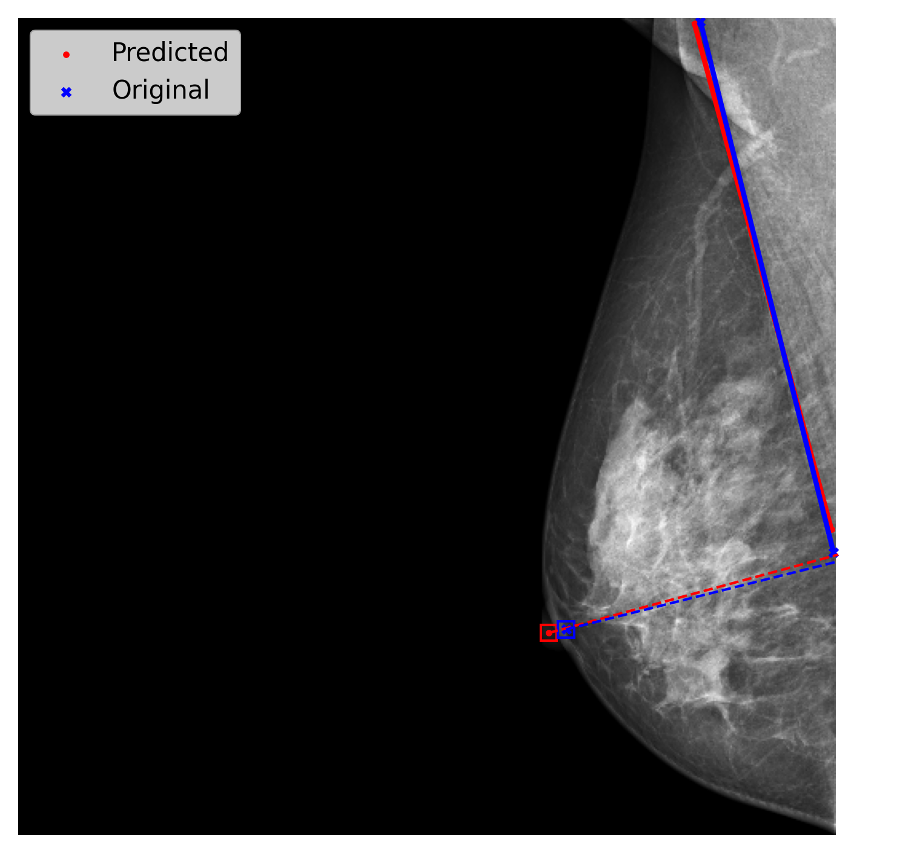
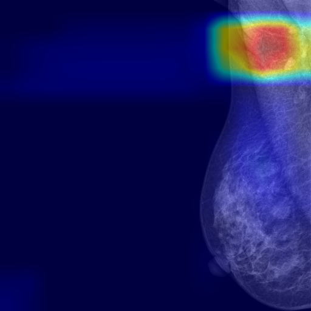
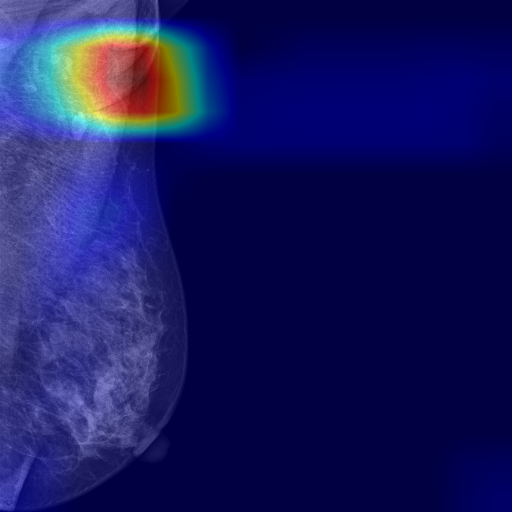
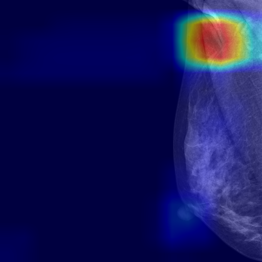

# MLO Breast Positioning Assessment via Deep Learning

Breast cancer is a leading cause of cancer-related mortality in women worldwide, making early detection through mammography screening critically important. The effectiveness of mammography, however, depends heavily on accurate breast positioning. Suboptimal positioning can result in missed findings, increased patient discomfort, and unnecessary repeat imaging.

This repository implements a deep learning pipeline for quantitative assessment of mediolateral oblique (MLO) mammogram positioning quality. The pipeline detects anatomical landmarks — the nipple and pectoralis muscle — and automatically delineates the Posterior Nipple Line (PNL) to evaluate positioning quality. Two segmentation-based regression models (UNet and Attention UNet) and one classification model (ResNeXt50) are included.

## Repository Structure

```
├── code/
│   ├── classification/          # ResNeXt50 binary quality classifier
│   │   ├── main.py              # Training entry point
│   │   ├── test.py              # Inference + GradCAM visualization
│   │   └── utils/               # Dataloader, model, loss, metrics
│   └── regression/              # Landmark regression models (UNet / Attention UNet)
│       ├── main/
│       │   ├── main.py          # Training entry point
│       │   ├── evaluation.py    # Evaluation with distance metrics
│       │   ├── visualize_test_predictions.py
│       │   └── utils/           # Dataloader, models, loss, train, validate
│       └── preprocessing/       # DICOM preprocessing pipeline
└── labels/                      # Dataset annotation details
```

## Dataset

Labels were created on 1,000 randomly selected MLO mammograms from the [VinDr-Mammo](https://vindr.ai/datasets/mammo) open-access dataset. Annotations were performed by two board-certified breast radiologists with over five years of breast imaging experience.

| Split      | Automated PNL-based Quality | Expert Qualitative Label |
|:----------:|:---------------------------:|:------------------------:|
| Training   | 967 good, 633 poor          | 1,185 good, 415 poor     |
| Validation | 108 good, 92 poor           | 132 good, 68 poor        |
| Testing    | 123 good, 77 poor           | 146 good, 54 poor        |

See [`labels/README.md`](labels/README.md) for full annotation details.

## Models

### Regression Models (Landmark Detection → Quality Assessment)

Both models are adapted for coordinate regression to predict nipple and pectoralis muscle landmark coordinates from grayscale mammographic images.

- **UNet** — Encoder–decoder architecture with skip connections, adapted for landmark regression.
- **Attention UNet (RAUNet)** — Extends UNet with attention gates at each decoder level to focus on anatomically relevant regions.

### Classification Model

- **ResNeXt50** — ResNeXt-50 (32×4d) fine-tuned for binary positioning quality classification (good / poor), adapted to accept single-channel (grayscale) input.

## Installation

```bash
git clone https://github.com/<your-username>/mlo-breast-positioning.git
cd mlo-breast-positioning
pip install torch torchvision pandas numpy scikit-learn matplotlib Pillow pydicom
```

## Usage

### Training — Regression Models

```bash
cd code/regression/main
python main.py --config configs/example_config.json
```

Edit `configs/example_config.json` to set paths and select model type (`"UNet"` or `"RAUNet"`).

### Training — Classification Model

```bash
cd code/classification
python main.py
```

Update the `config` dictionary in `main.py` with your dataset paths and desired hyperparameters.

### Evaluation — Regression

```bash
cd code/regression/main
python evaluation.py --config configs/example_eval_config.json
```

### Inference + GradCAM — Classification

```bash
cd code/classification
python test.py
```

GradCAM visualizations are saved to `gradcam_outs/`.

## Performance

Distance errors are reported as mean (μ), standard deviation (σ), and median (x̃) in millimeters. Classification results are reported as mean ± standard deviation across 5 independent training runs.

### Landmark Distance Errors (mm)

| Model          | Perp μ | Perp σ | Perp x̃ | Pec1 μ | Pec1 σ | Pec1 x̃ | Pec2 μ | Pec2 σ | Pec2 x̃ | Nipple μ | Nipple σ | Nipple x̃ | Angular μ | Angular σ | Angular x̃ |
|----------------|--------|--------|---------|--------|--------|---------|--------|--------|---------|----------|----------|-----------|-----------|-----------|------------|
| UNet           | 9.62   | 7.86   | 8.03    | 8.19   | 6.89   | 6.01    | 14.01  | 14.01  | 10.90   | 6.80     | 5.25     | 5.72      | 3.52      | 3.15      | 2.66       |
| Attention UNet | **5.12** | **5.04** | **3.56** | **6.01** | **5.87** | **4.03** | **6.94** | **8.25** | **3.95** | **2.98** | **2.40** | **2.52** | **2.58** | **2.73** | **1.81** |

### Positioning Quality Classification

Results on automatically generated PNL-based quality labels. The Attention UNet pipeline (RAUNet) predicts landmark coordinates and derives positioning quality from the resulting PNL.

| Model          | Accuracy (%)         | Specificity (%)      | Sensitivity (%)      |
|----------------|----------------------|----------------------|----------------------|
| ResNeXt50      | 73.7 ± 3.35          | 76.91 ± 6.26         | 68.57 ± 11.41        |
| UNet           | 70.63 ± 1.49         | 78.46 ± 1.56         | 58.12 ± 2.68         |
| Attention UNet | **88.2 ± 2.51**      | **88.62 ± 4.11**     | **87.53 ± 3.51**     |

## Example Predictions

### Attention UNet — Landmark Predictions



### ResNeXt50 — GradCAM Visualization

<p align="center">
  
  
  
</p>

## Contributing

Contributions are welcome. For significant changes, please open an issue first to discuss the proposed modification.
