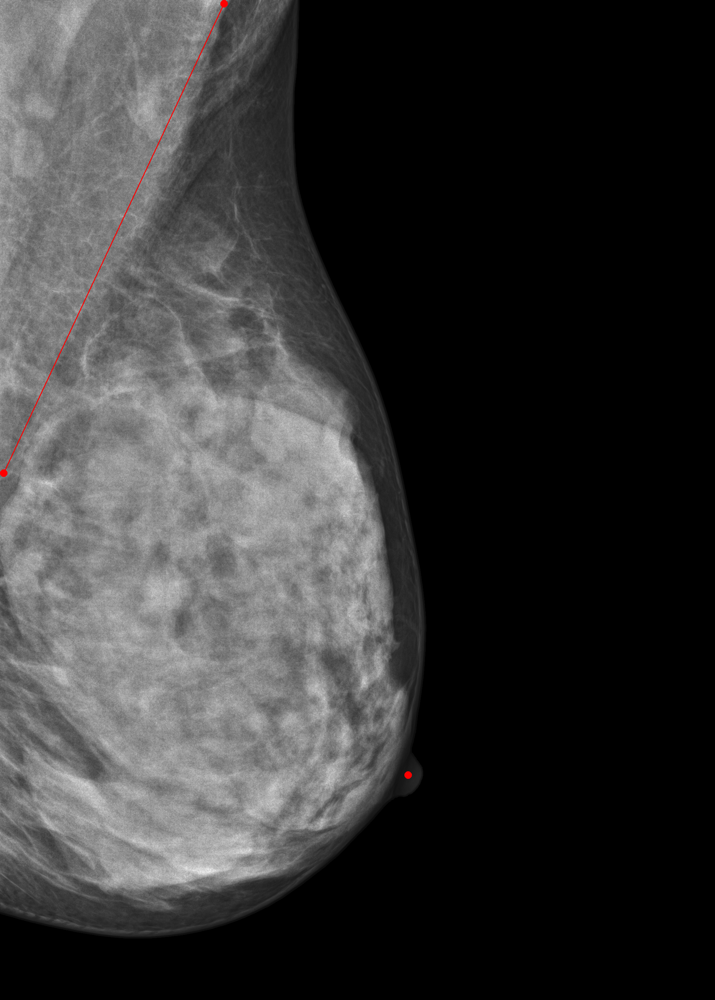

# Label Description

## Definition of Findings

| Label                       | Explanation                                                                                                                |
|-----------------------------|----------------------------------------------------------------------------------------------------------------------------|
| Nipple Bounding Box         | A bounding box surrounding the nipple region                                                                               |
| Pectoralis Muscle Line      | A line delineating the pectoralis muscle, starting from its inferior end                                                   |
| Posterior Nipple Line (PNL) | A line perpendicular to the pectoralis muscle line, originating from the center of the nipple bounding box                 |
| Qualitative Quality Label   | An image-level quality label assigned by an expert radiologist based on PNL criteria and broader clinical experience       |

## Dataset

Labels were created on 1,000 randomly selected MLO mammograms drawn from the publicly available **VinDr-Mammo** dataset (Nguyen et al., 2023). VinDr-Mammo contains 5,000 full-field digital mammography exams collected from opportunistic screening in two Vietnamese hospitals between 2018 and 2020.

Ground truth annotations were performed by two board-certified breast radiologists (N.D. and E.C.) with over five years of experience in breast imaging.

### Quantitative Labels (`data`)

Radiologist N.D. annotated mammograms using a browser-based annotation tool ([matrix.md.ai](https://matrix.md.ai)) on a 6-megapixel diagnostic monitor (Radiforce RX 660, EIZO), reviewing all images in DICOM format. Annotations followed ACR and RANZCR positioning guidelines (ACR, 1999; RANZCR, 2002) and included:

- The nipple location (bounding box)
- The pectoralis muscle line from its inferior end on MLO views

> **Note:** PNL coordinates are not provided directly. The PNL is automatically derived by applying a 90° perpendicular rule from the nipple coordinate to the pectoralis muscle line, ensuring geometric consistency across all samples.

### Qualitative Labels (`qualitativeLabel`)

Radiologist E.C. independently assessed each MLO view and classified breast positioning as **good** or **poor** based on ACR quality standards (Hendrick et al., 1999).

## Split Distribution

| Split      | Automated PNL-based Quality | Expert Qualitative Label  |
|:----------:|:---------------------------:|:-------------------------:|
| Training   | 967 good, 633 poor          | 1,185 good, 415 poor      |
| Validation | 108 good, 92 poor           | 132 good, 68 poor         |
| Testing    | 123 good, 77 poor           | 146 good, 54 poor         |

  

## CSV Column Descriptions

| Column                    | Description                                                                                  |
|---------------------------|----------------------------------------------------------------------------------------------|
| `StudyInstanceUID`        | Unique identifier for the study (exam)                                                       |
| `SOPInstanceUID`          | Unique identifier for the image instance within an exam                                      |
| `annotationMode`          | Annotation type: `"line"` for pectoralis, `"bbox"` for nipple                               |
| `labelName`               | Label name: `Pectoralis` or `Nipple`                                                         |
| `data`                    | Vertex coordinates for lines or bounding box corners                                         |
| `qualitativeLabel`        | Image-level quality label from a second expert radiologist (`good` / `poor`)                 |
| `height`                  | Image height in pixels                                                                       |
| `width`                   | Image width in pixels                                                                        |
| `SeriesDescription`       | Imaging view (e.g., `L-MLO`, `R-MLO`)                                                       |
| `ImagerPixelSpacing`      | Physical pixel spacing (mm/pixel)                                                            |
| `SeriesInstanceUID`       | Unique identifier for the image series                                                       |
| `ManufacturerModelName`   | Manufacturer and model name of the imaging device                                            |
| `PhotometricInterpretation` | Photometric interpretation of the image (e.g., `MONOCHROME1`, `MONOCHROME2`)             |
| `Split`                   | Dataset partition: `Train`, `Validation`, or `Test`                                          |

## References

1. Hendrick, R.E., Bassett, L., Botsco, M.A., et al. (1999). *Mammography Quality Control Manual*. American College of Radiology.
2. Nguyen, H.T., Nguyen, H.Q., Pham, H.H., et al. (2023). VinDr-Mammo: A large-scale benchmark dataset for computer-aided diagnosis in full-field digital mammography. *Scientific Data*, 10, 277. [https://doi.org/10.1038/s41597-023-02100-7](https://doi.org/10.1038/s41597-023-02100-7)
3. Royal Australian and New Zealand College of Radiologists (2002). *Mammography Quality Assurance Program*.
