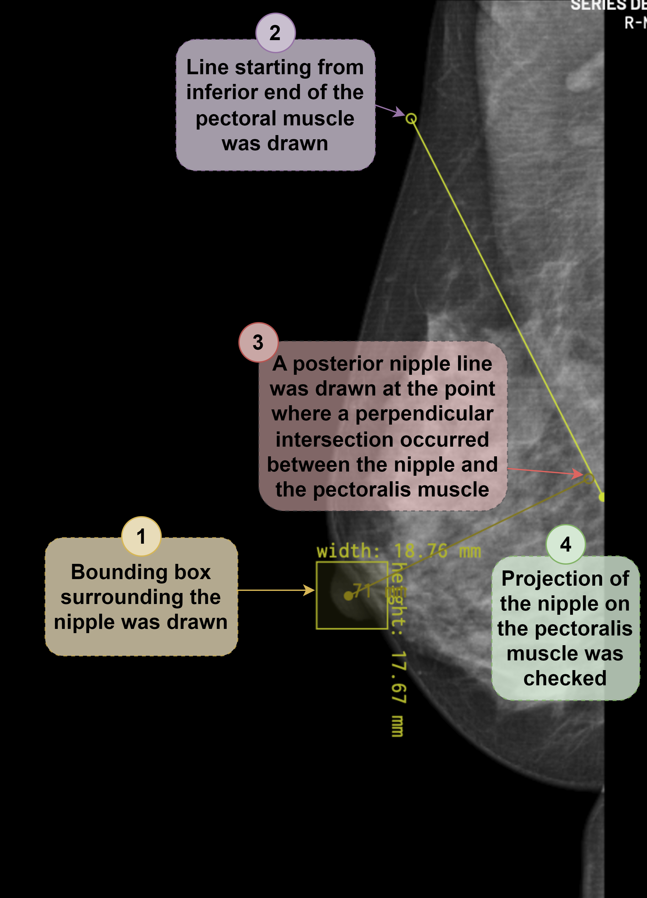

# Label Description

## Definition of Findings

| Label                       | Explanation                                                                                                                |
|-----------------------------|----------------------------------------------------------------------------------------------------------------------------|
| Nipple Bounding Box         | A bounding box surrounding the nipple region                                                                               |
| Pectoralis Muscle Line      | A line delineating the pectoralis muscle, starting from its inferior end                                                   |
| Posterior Nipple Line (PNL) | A line perpendicular to the pectoralis muscle line, originating from the center of the nipple bounding box                 |
| Qualitative Quality Label   | An image-level quality label assigned by an expert radiologist based on PNL criteria and broader clinical experience       |

## Dataset

Labels were created on **1,000 mammography exams (2,000 MLO images — L-MLO + R-MLO per exam)** drawn from the publicly available **VinDr-Mammo** dataset. VinDr-Mammo contains 5,000 full-field digital mammography exams collected from opportunistic screening in two Vietnamese hospitals between 2018 and 2020.

### Quantitative Labels (`data`)

Landmark annotations (nipple bounding box + pectoral muscle line) were performed by a single board-certified breast radiologist (**N.D.**, >5 years of breast imaging experience), using a browser-based annotation tool ([matrix.md.ai](https://matrix.md.ai)) on a 6-megapixel diagnostic monitor (Radiforce RX 660, EIZO), reviewing all images in DICOM format. Annotations followed ACR and RANZCR positioning guidelines and included:

- The nipple location (bounding box)
- The pectoralis muscle line from its inferior end on MLO views

> **Note:** PNL coordinates are not provided directly. The PNL is automatically derived by applying a 90° perpendicular rule from the nipple coordinate to the pectoralis muscle line, ensuring geometric consistency across all samples.

### Qualitative Labels (`qualitativeLabel`)

A second expert radiologist (**E.C.**, >10 years of mammography interpretation experience) independently assessed each MLO view and classified breast positioning as **good** or **poor** based on holistic ACR quality standards.

## Cross-Validation Pool Distribution

The 2,000-image pool was evaluated under 10-fold stratified cross-validation. Pool-level label counts:

| Reference                          | Good  | Poor |
|------------------------------------|------:|-----:|
| Automated PNL-derived              | 1,253 |  747 |
| Expert qualitative (holistic ACR)  | 1,463 |  537 |

Fold 1 corresponds to the original `Train` / `Validation` / `Test` split encoded in `positioning_labels.csv`. Folds 2–10 are generated by `scripts/cv_splits.py` (`rotating_9` mode), which writes `positioning_labels_fold_{2..10}.csv` files alongside this README. See [`../scripts/cv_splits.py`](../scripts/cv_splits.py) for the exact partitioning logic.

## Annotation Example

The figure below illustrates the annotation structure: the nipple bounding box, the pectoralis muscle line, and the automatically derived PNL on an example MLO mammogram.

  

## CSV Column Descriptions

| Column                      | Description                                                                                  |
|-----------------------------|----------------------------------------------------------------------------------------------|
| `StudyInstanceUID`          | Unique identifier for the study (exam)                                                       |
| `SOPInstanceUID`            | Unique identifier for the image instance within an exam                                      |
| `annotationMode`            | Annotation type: `"line"` for pectoralis, `"bbox"` for nipple                               |
| `labelName`                 | Label name: `Pectoralis` or `Nipple`                                                         |
| `data`                      | Vertex coordinates for lines or bounding box corners                                         |
| `qualitativeLabel`          | Image-level quality label from the expert radiologist; stored as `Good` or `Bad` (paper terminology: good / poor) |
| `height`                    | Image height in pixels                                                                       |
| `width`                     | Image width in pixels                                                                        |
| `SeriesDescription`         | Imaging view (e.g., `L-MLO`, `R-MLO`)                                                       |
| `ImagerPixelSpacing`        | Physical pixel spacing (mm/pixel)                                                            |
| `SeriesInstanceUID`         | Unique identifier for the image series                                                       |
| `ManufacturerModelName`     | Manufacturer and model name of the imaging device                                            |
| `PhotometricInterpretation` | Photometric interpretation of the image (e.g., `MONOCHROME1`, `MONOCHROME2`)                |
| `Split`                     | Dataset partition: `Train`, `Validation`, or `Test`                                          |
